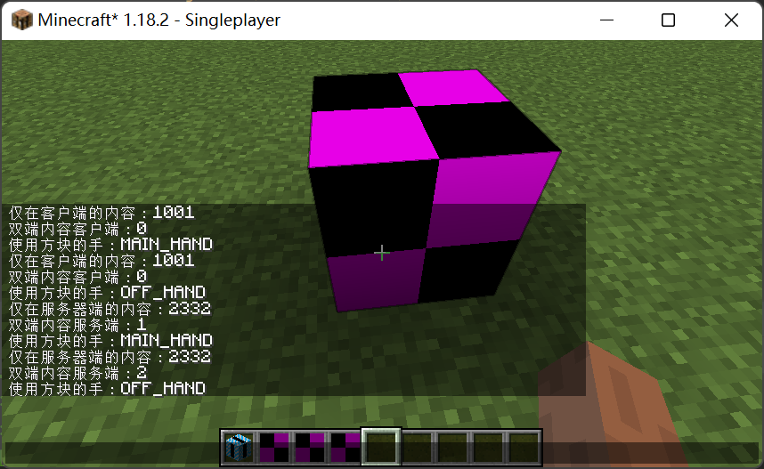
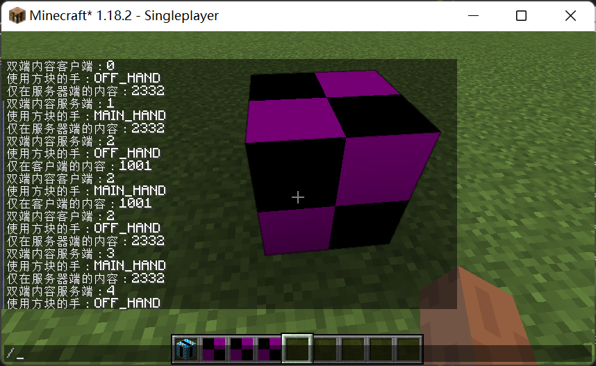

# 第一个 BlockEntity

注册部分：

```java
public class TutorialBlocks {
    private static final DeferredRegister<Block> BLOCKS = DeferredRegister.create(ForgeRegistries.BLOCKS, Tutorial.MOD_ID);
    private static final DeferredRegister<Item> ITEMS = DeferredRegister.create(ForgeRegistries.ITEMS, Tutorial.MOD_ID);

    public static final RegistryObject<Block> TUTORIAL_BLOCK = BLOCKS.register("tutorial_block",
            () -> new TutorialBlockEntityBlock(BlockBehaviour.Properties.of(Material.STONE)));

    public static final RegistryObject<Item> TUTORIAL_BLOCK_ITEM = fromBlock("tutorial_block", TUTORIAL_BLOCK);

    private static RegistryObject<Item> fromBlock(String name, RegistryObject<Block> block) {
        return ITEMS.register(name, () -> new BlockItem(block.get(), new Item.Properties().tab(ModSetup.ITEM_GROUP)));
    }

    public static void register(IEventBus bus) {
        BLOCKS.register(bus);
        ITEMS.register(bus);
    }
}


public class TutorialBlockEntities {
    private static final DeferredRegister<BlockEntityType<?>> BLOCK_ENTITIES =
            DeferredRegister.create(ForgeRegistries.BLOCK_ENTITIES, Tutorial.MOD_ID);

    public static final RegistryObject<BlockEntityType<TutorialBlockEntity>> TUTORIAL_BLOCK_ENTITY =
            BLOCK_ENTITIES.register("tutorial_block_entity", () ->
                    BlockEntityType.Builder.of(TutorialBlockEntity::new, TutorialBlocks.TUTORIAL_BLOCK.get()).build(null));

    public static void register(IEventBus bus) {
        BLOCK_ENTITIES.register(bus);
    }
}

@Mod(Tutorial.MOD_ID)
public class Tutorial {
    ...
    
    public Tutorial() {
        ...
        
        IEventBus modbus = FMLJavaModLoadingContext.get().getModEventBus();

        ...

        // 不要忘了在主类调用注册方法
        TutorialBlockEntities.register(modbus);
        TutorialBlocks.register(modbus);
    }
}
```

BlockEntity 类：

```java
public class TutorialBlockEntity extends BlockEntity {
    public TutorialBlockEntity(BlockPos pWorldPosition, BlockState pBlockState) {
        super(TutorialBlockEntities.TUTORIAL_BLOCK_ENTITY.get(), pWorldPosition, pBlockState);
    }

    int count;

    boolean initialized = false;
    int serverMsg;
    int clientMsg;

    public void use(Player player) {
        if (getLevel().isClientSide()) {
            if (!initialized) {
                clientMsg = 1001;
                initialized = true;
            }

            // 调试信息，展示了不同步状态下的信息
            player.sendMessage(new TextComponent("仅在客户端的内容：" + clientMsg), player.getUUID());
            player.sendMessage(new TextComponent("双端内容客户端：" + count), player.getUUID());
        }
        else {
            if (!initialized) {
                serverMsg = 2332;
                initialized = true;
            }

            // 调试信息，展示了不同步状态下的信息
            player.sendMessage(new TextComponent("仅在服务器端的内容：" + serverMsg), player.getUUID());

            count++;
            player.sendMessage(new TextComponent("双端内容服务端：" + count), player.getUUID());

            sync();
        }
    }

    /** 同步的方法，看不懂就照抄，调用它会调用下面的 getUpdateTag */
    protected void sync() {
        if (!level.isClientSide) {
            ClientboundBlockEntityDataPacket p = ClientboundBlockEntityDataPacket.create(this);
            ((ServerLevel)this.level).getChunkSource().chunkMap.getPlayers(new ChunkPos(getBlockPos()), false)
                    .forEach(k -> k.connection.send(p));
        }
    }

    /** 网络包会调用这个方法（服务端） */
    @Override
    public CompoundTag getUpdateTag() {
        CompoundTag result = new CompoundTag();

        result.putInt("count", count);

        return result;
    }

    /** 持久化会调用这个方法：也就是说，你退出游戏再进入游戏，数据不会消失就是它的作用（服务端） */
    @Override
    protected void saveAdditional(CompoundTag pTag) {
        pTag.putInt("count", count);
    }

    /**
     * 不论是网络包还是持久化都会调用这个方法，从 nbt 加载数据（服务端（持久化）/客户端（网络包））
     * 注意，此时的 BlockEntity *没有* 初始化 level，所以此时 getLevel 一定会报错
     * 但服务端的内容不会自动同步到客户端，怎么办呢？见下方的解决方法
     */
    @Override
    public void load(CompoundTag pTag) {
        super.load(pTag);

        count = pTag.getInt("count");

        // 虽然此时的客户端上的 needSync 也被修改了，但由于这个字段不会在客户端使用所以无需担心
        needSync = true;
    }

    /** 每 tick 都会调用，仅在客户端上执行 */
    public static void clientTick(Level level, BlockPos pos, BlockState state, BlockEntity o) {

    }

    /** 每 tick 都会调用，仅在服务端上执行 */
    public static void serverTick(Level level, BlockPos pos, BlockState state, TutorialBlockEntity e) {
        e.syncTick();
    }

    // 同步的解决方案

    boolean needSync;

    void syncTick() {
        if (needSync) {
            sync();
            needSync = false;
        }
    }
}
```

对应的 EntityBlock 类：

```java
public class TutorialBlockEntityBlock extends BaseEntityBlock {
    public TutorialBlockEntityBlock(Properties p_49795_) {
        super(p_49795_);
    }

    /** 注意，BaseEntityBlock 默认覆写此方法，导致不手动修改会不显示方块原有的模型（但是显示 BlockEntityRenderer） */
    @Override
    public RenderShape getRenderShape(BlockState pState) {
        return RenderShape.MODEL;
    }

    /** 右键这个方块的时候会调用 */
    @Override
    public InteractionResult use(BlockState pState, Level pLevel, BlockPos pPos, Player pPlayer, InteractionHand pHand, BlockHitResult pHit) {
        if (pLevel.getBlockEntity(pPos) instanceof TutorialBlockEntity tbe) {
            tbe.use(pPlayer);
            pPlayer.sendMessage(new TextComponent("使用方块的手：" + pHand.name()), pPlayer.getUUID());
        }

        return super.use(pState, pLevel, pPos, pPlayer, pHand, pHit);
    }

    /** 1.18 一个让我觉得比较神经病的改变，把 tick 方法从 BlockEntity 里拆了出来 */
    @Nullable
    @Override
    public <T extends BlockEntity> BlockEntityTicker<T> getTicker(Level pLevel, BlockState pState, BlockEntityType<T> pBlockEntityType) {
        return BaseEntityBlock.createTickerHelper(pBlockEntityType, TutorialBlockEntities.TUTORIAL_BLOCK_ENTITY.get(),
                pLevel.isClientSide ? TutorialBlockEntity::clientTick : TutorialBlockEntity::serverTick);
    }

    @Nullable
    @Override
    public BlockEntity newBlockEntity(BlockPos pPos, BlockState pState) {
        return new TutorialBlockEntity(pPos, pState);
    }
}

```

打开游戏测试一下



可以见到，主手和副手分别在客户端和服务端触发了一次 use 方法。



再次点击：此时服务端已向客户端同步，所以我们能看到在上次 use 时服务端的 count 已经被同步到了客户端了。