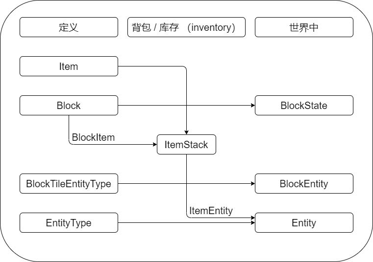

# Minecraft 中的概念
**定义**：这些是相同注册名**只有一个实例**的对象。例如：注册名叫做“钻石剑（diamond_sword）”的 **物品（Item）**只有一个，但是你能做出不止一把钻石剑，这时的两把钻石剑是不同的 **物品堆（ItemStack）**，但他们指代了同一个物品。这很重要！

**库存（Inventory）**：玩家或者其他容器的库存中所有对象都用物品堆表示。物品堆是物品在实际游戏时的实例。注意：为了能够在库存中持有方块（Block）需要对应的物品。

**世界中**：方块作为**方块状态（[BlockState](https://minecraft.fandom.com/zh/wiki/%E6%96%B9%E5%9D%97%E7%8A%B6%E6%80%81)）**的方式存在于世界中，方块状态是方块的特殊配置。例如：一个熔炉有四个方向，这是 6 种不同的方块状态。此外，熔炉也分为燃烧与否，这意味着总共有 12 种不同的方块状态。**方块实体（BlockEntity）**是帮助方块保存更多信息（比如库存），以及帮助方块做什么事（比如 tick）的对象。

