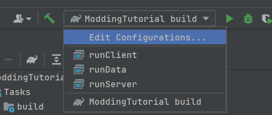

# 基础项目配置
选择使用 Minecraft Development 插件的可以跳过该节。（该插件在[该页面](../开始/建议.md)有提到）

首先，你需要一份 MDK，你可以在该网址：[Downloads for Minecraft Forge for Minecraft 1.18.2](https://files.minecraftforge.net/net/minecraftforge/forge/)下载到。

下载后解压，把以下内容复制粘贴到一个你喜欢的新文件夹：
- *gradle* 文件夹
- *src* 文件夹
- *gradlew.bat* 和 *gradlew* 文件
- *build.gradle* 和 *gradle.properties* 文件
- *.gitignore* 文件

**确保你的 jdk 版本为 17**，然后在 idea 中 file -> open -> 选择该文件夹，或将 ‘build.gradle’ 作为项目 (as a project) 打开。

---

由于国内的复杂的网络环境，你可能需要一个梯子，具体内容不多赘述，这里提醒你不要忘记配置 idea 的 proxy。

---

接着，你需要更改 mod 的 mod id，你需要改以下几个地方的内容：
- *build.gradle*
- *src/main/resources/META-INF/mods.toml*
- mod 的主类，在 MDK 中叫做 ExampleMod，你可以将它改成更好的名字，不要忘了 @Mod 注解里的 mod id。

modid **只**能由小写字母和下划线组成，在之前还包括 '-'，但是 1.18 的 modid 已经不允许了。

最后，你需要生成 idea 的运行配置。

再重复一次：**确保你的 jdk 版本为 17**。

idea 界面右侧有一个大象图标的 Gradle 选项卡，点开他，在 Tasks -> forgegradle runs 中双击 genIntellijRuns。

稍等片刻后你可以看到以下内容：

选择 runClient 并点击绿色小箭头，等待游戏启动：

