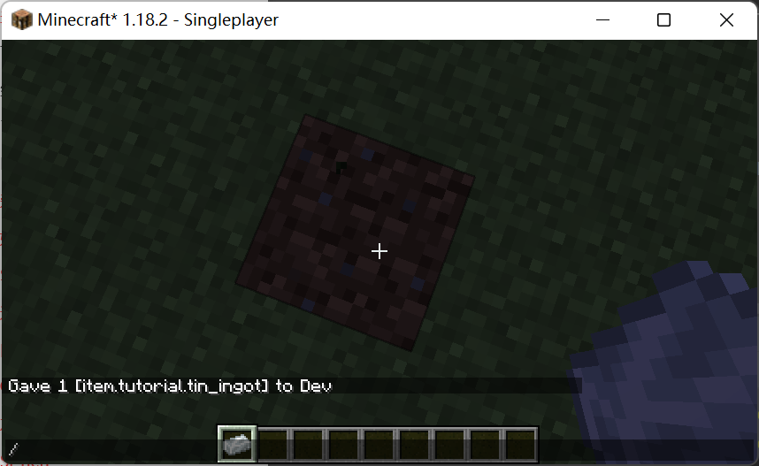

# 第一个物品

制作一个物品需要几步？
1. 创建一个物品类（可选）
2. 注册并告知 Forge 实例化
3. 为他添加模型、纹理等资源文件
   
在 MC 中，我们经常会见到各种金属的锭与块，接下来我们将用一个个案例为大家做出一整套的“锡制产品”。

## 创建一个物品类

在 Minecraft 中，所有的物品都是`Item`的子类，我们自然也要继承这个类：

```java
public class TinItem extends Item {
    public TinItem(Properties pProperties) {
        super(pProperties);
    }
}
```

可能已经有人注意到了，为什么前文说创建一个物品类是可选的？因为在我们不需要我们的物品做任何事的时候直接实例化`Item`类即可。

## 注册并告知 Forge 实例化

首先，我们需要请出我们的重量级嘉宾，`DeferredRegister`，它是Forge在1.13版本时加入的最新也是最为推荐的注册方式。代码简单易写，可以很容易将复杂的注册代码以更加清晰简洁的格式编写出来。

物品的注册类：

**请注意：注册名内只允许出现小写字母与下划线**

```java
public class TutorialItems {
    /** 不要忘记把 Tutorial.MOD_ID 改为你自己的 modid */
    public static final DeferredRegister<Item> ITEMS = DeferredRegister.create(ForgeRegistries.ITEMS, Tutorial.MOD_ID);

    /** 这里的 register 是注册物品，前面的 String 参数就是注册名，上方的 modid 就是 命名空间。*/
    public static final RegistryObject<Item> TIN_INGOT = ITEMS.register("tin_ingot", () -> new TinIngotItem(new Item.Properties()));
}
```

```java
public class Tutorial {
    ...

    public Tutorial() {
        ...

        IEventBus modbus = FMLJavaModLoadingContext.get().getModEventBus();
        
        ...

        // 注意，不要忘了在主类调用这个方法
        // 这里的 register 是将 ITEMS 注册到 IEventBus 中，通知 Forge 之后将该 DeferredRegister 中的对象实例化
        TutorialItems.ITEMS.register(modbus);
    }
}
```

`RegistryObject`继承了一个函数式接口`Supplier`，所以使用时需要`RegistryObject#get`方法来获取实际的 item。

这段内容对刚学习 java 的人来说可能有些难以理解，没有关系，先跟着做，在之后积累了足够的知识与经验后再回过头来看会有不同的收获。

此时如果你打开游戏，输入`/give Dev tutorial:tin_ingot`，就能得到这个物品了，一个···紫黑块。

## 模型与纹理

每一个`Item`都值得···都应该有个模型，不然就会变成一个紫黑块。

第一步，先在`resources`目录下创建`assets/{你的modid}/models/item`文件夹，然后在该文件夹中创建 tin_ingot.json。

使用 idea 右上角一个放大镜图标的功能，“Search Everywhere”，搜索 “iron_ingot.json”，打开它，你应该可以发现这样的东西：

```json
{
  "parent": "minecraft:item/generated",
  "textures": {
    "layer0": "minecraft:item/iron_ingot"
  }
}
```

发挥程序员的特长（没有冒犯的意思），ctrl + c，ctrl + v，粘贴到我们的 tin_ingot.json 中。

`parent`部分表示继承的模型，这里的是原版的`minecraft:item/generated`，对应的目录就是`assets/minecraft/models/item/generated`。

`textures`定义了这个模型使用的纹理，`layer0`部分对应的路径就是`assets/minecraft/textures/item/iron_ingot.png`。

详细的内容可以在 [mcwiki](https://minecraft.fandom.com/zh/wiki/%E6%A8%A1%E5%9E%8B) 找到，这也是一般 modder 在使用数据包 / 资源包相关内容时最常查阅的网站。

现在我们进行一些小小的修改：
```json
{
  "parent": "minecraft:item/generated",
  "textures": {
    "layer0": "tutorial:item/tin_ingot"
  }
}
```

最后再将 tin_ingot.png 放到`assets/{你的modid}/textures/item`下。


可以在[这里](https://github.com/TT432/ModdingTutorial118/blob/main/docs/1%E5%9F%BA%E7%A1%80/%E7%89%A9%E5%93%81/tin_ingot.png)找到。

让我们打开游戏试一下吧！

