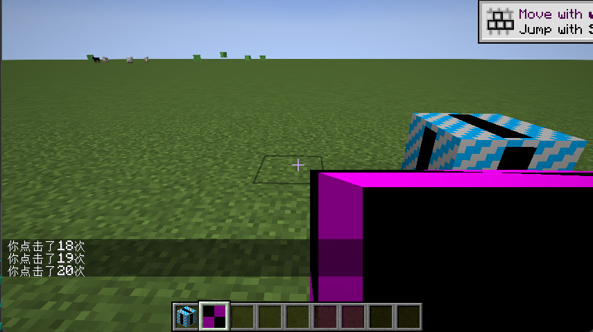

# Capability

Capability 是一套由 forge 添加的系统，可以方便得帮你把数据附加到各种对象上，同时也可以作为跨 mod 的兼容（例如：FE，ItemStackHandler）。

接下来将以为玩家附加一个 Capability 作为演示，讲述它的使用方法。

先创建一个 Capability 类：

```java
public class TutorialCapability implements INBTSerializable<CompoundTag> {
    Player player;

    public TutorialCapability(Player player) {
        this.player = player;
    }

    private int clickCount = 0;

    public void click() {
        clickCount++;
        player.displayClientMessage(new TextComponent("你点击了" + clickCount + "次"), false);
    }

    @Override
    public CompoundTag serializeNBT() {
        CompoundTag result = new CompoundTag();
        result.putInt("clickCount", clickCount);
        return result;
    }

    @Override
    public void deserializeNBT(CompoundTag nbt) {
        clickCount = nbt.getInt("clickCount");
    }
}
```

为了它能够附加到玩家身上，我们还需要一个 CapabilityProvider：

```java
public class TutorialCapabilityProvider extends CapabilityProvider<TutorialCapabilityProvider> implements INBTSerializable<CompoundTag> {
    public static final Capability<TutorialCapability> CAPABILITY = CapabilityManager.get(new CapabilityToken<>(){});

    private final LazyOptional<TutorialCapability> capability;

    protected TutorialCapabilityProvider(Player player) {
        super(TutorialCapabilityProvider.class);
        capability = LazyOptional.of(() -> new TutorialCapability(player));
    }

    @NotNull
    @Override
    public <T> LazyOptional<T> getCapability(@NotNull Capability<T> cap, @Nullable Direction side) {
        return CAPABILITY.orEmpty(cap, capability);
    }

    @Override
    public CompoundTag serializeNBT() {
        return capability.resolve().isPresent() ? capability.resolve().get().serializeNBT() : new CompoundTag();
    }

    @Override
    public void deserializeNBT(CompoundTag nbt) {
        capability.ifPresent(cap -> cap.deserializeNBT(nbt));
    }
}
```

保存数据的载体是 CapabilityProvider，如果它实现了 INBTSerializable 就会自动保存数据到相应对象的 nbt 中。

注意：他并不会自动同步服务端到客户端的差异，同步的方法将在下张讲到。

接下来需要在 TutorialCapabilityRegistry 中注册我们的 capability：

```java
/** 构建对象时触发该事件，本案例中在新玩家进入游戏时为他附加 Capability */
public static void onAttachCapabilitiesPlayer(AttachCapabilitiesEvent<Entity> event){
    if (event.getObject() instanceof Player) {
        if (!event.getObject().getCapability(TutorialCapabilityProvider.CAPABILITY).isPresent()) {
            // The player does not already have this capability so we need to add the capability provider here
            event.addCapability(new ResourceLocation(Tutorial.MOD_ID, "tutorial_cap"),
                    new TutorialCapabilityProvider((Player) event.getObject()));
        }
    }
}
/** 在玩家死亡或传送到其他世界时触发，我们将跟随 gamerule 保存我们的 capability */
public static void onPlayerCloned(PlayerEvent.Clone event) {
    Player player = event.getPlayer();
    if (event.isWasDeath()) {
        if (player.level instanceof ServerLevel serverLevel) {
            var keepInventory = serverLevel.getServer().getGameRules().getRule(GameRules.RULE_KEEPINVENTORY);
            if (keepInventory.get()) {
                event.getOriginal().getCapability(TutorialCapabilityProvider.CAPABILITY).ifPresent(oldStore -> {
                    event.getPlayer().getCapability(TutorialCapabilityProvider.CAPABILITY).ifPresent(newStore -> {
                        newStore.deserializeNBT(oldStore.serializeNBT());
                    });
                });
            }
        }
    }
}
/** 最后，我们在该事件注册我们的 capability */
public static void onRegisterCapabilities(RegisterCapabilitiesEvent event) {
    event.register(TutorialCapability.class);
}
```

而后，在 ModSetup 中新建一个方法：

```java
public static void setup() {
    IEventBus bus = MinecraftForge.EVENT_BUS;
    bus.addGenericListener(Entity.class, TutorialCapabilityRegistry::onAttachCapabilitiesPlayer);
    bus.addListener(TutorialCapabilityRegistry::onPlayerCloned);
    bus.addListener(TutorialCapabilityRegistry::onRegisterCapabilities);
}
```

最后在主类调用它即可。

我们来写个测试物品试一下吧：

```java
public class TestItem extends Item {
    public TestItem(Properties pProperties) {
        super(pProperties);
    }

    @Override
    public InteractionResultHolder<ItemStack> use(Level pLevel, Player pPlayer, InteractionHand pUsedHand) {
        if (pLevel.isClientSide) {
            return InteractionResultHolder.consume(pPlayer.getItemInHand(pUsedHand));
        }

        pPlayer.getCapability(TutorialCapabilityProvider.CAPABILITY).ifPresent(TutorialCapability::click);

        return super.use(pLevel, pPlayer, pUsedHand);
    }
}
```

