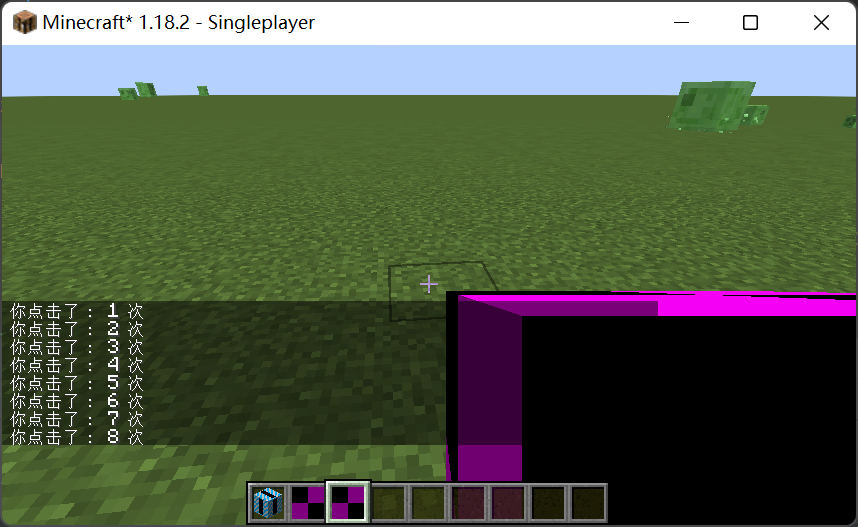

# SavedData

SavedData 是一种在世界中保存信息的方法，原版在地图之类的地方有使用，另外 forge 的 WorldCapabilityData 也是此类的子类。

```java
public class TutorialSavedData extends SavedData {
    private static final String NAME = "TUTORIAL";

    public static TutorialSavedData get(Level level) {
        if (level instanceof ServerLevel serverLevel) {
            return serverLevel.getDataStorage().computeIfAbsent(TutorialSavedData::read, TutorialSavedData::new, NAME);
        } else {
            throw new RuntimeException("只能在服务端获取 SavedData ！ 出错位置： " + NAME);
        }
    }

    private int count = 0;

    public void click(Player player) {
        count++;
        player.sendMessage(new TextComponent("你点击了： " + count + " 次"), player.getUUID());
    }

    /** 从 tag 中读取 SavedData */
    public static TutorialSavedData read(CompoundTag tag) {
        TutorialSavedData result = new TutorialSavedData();
        result.count = tag.contains("count") ? tag.getInt("count") : 0;
        return result;
    }

    /** 保存信息到 Tag 中 */
    @Override
    public CompoundTag save(CompoundTag pCompoundTag) {
        pCompoundTag.putInt("count", count);
        return pCompoundTag;
    }
}
```

写个测试物品试一下吧！

```java
public class TestSavedDataItem extends Item {
    public TestSavedDataItem(Properties pProperties) {
        super(pProperties);
    }

    @Override
    public InteractionResultHolder<ItemStack> use(Level pLevel, Player pPlayer, InteractionHand pUsedHand) {
        if (!pLevel.isClientSide) {
            TutorialSavedData.get(pLevel).click(pPlayer);
        }

        return super.use(pLevel, pPlayer, pUsedHand);
    }
}
```

