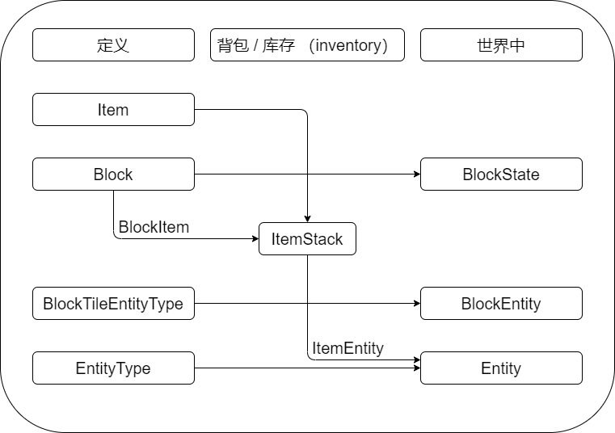

# Minecraft 中的概念
**定义**：这些是游戏内**只有一个**实例（instance）的对象（[单例模式](https://www.runoob.com/design-pattern/singleton-pattern.html)）。例如：只有一个”钻石剑“，如果你的背包内有两把钻石，他们是两个不同的 **物品堆（ItemStack）**。而这两个物品堆指的是同一个 **物品（Item）**。这很重要！

**库存（Inventory）**：玩家或者其他容器的库存中所有对象都用物品堆表示。物品堆是物品在实际游戏时的实例。注意：为了能够在库存中持有方块（Block）需要对应的 Item。

**世界中**：方块作为**方块状态（BlockState）**的方式存在于世界中，方块状态是方块的特殊配置。例如：一个熔炉有四个方向，这是 6 种不同的方块状态。此外，熔炉也分为燃烧与否，这意味着总共有 12 种不同的方块状态。**方块实体（BlockEntity）**是帮助方块保存更多信息的对象（比如库存）。

