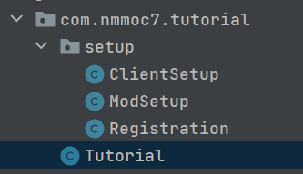

# 项目结构
项目结构是较为自由的，但在这个教程里我将让 mod 主类尽可能的小，并且在助手类中完成所有需要的设置。

此时的主类像是这样：
```java
@Mod(Tutorial.MOD_ID)  
public class Tutorial {  
 // 这里应该改成你自己的 mod id public static final String MOD_ID = "tutorial";  
 private static final Logger LOGGER = LogManager.getLogger();  
  
 public Tutorial() {  
 	// 注册 DeferredRegistry 
	Registration.init();  
  
 	// 为 mod 加载注册设置方法  
 	IEventBus modbus = 		 FMLJavaModLoadingContext.get().getModEventBus();  
 	// 注册 'ModSetup::init'，它将在 mod setup 时被调用。 (服务端和客户端) 
 	modbus.addListener(ModSetup::init);  
 	// 注册 'ClientSetup::init'， 它将在 mod setup 时被调用。 (仅客户端)  
 	DistExecutor.unsafeRunWhenOn(Dist.CLIENT, () -> () -> modbus.addListener(ClientSetup::init));  
 }  
}
```
然后我们创建一个名为 setup 的包，并且创建三个类文件，他们的内容分别是：
```java
public class ClientSetup {  
 public static void init(final FMLClientSetupEvent event) {  
 }
}
```
```java
public class ModSetup {  
 public static void init(final FMLCommonSetupEvent event) {  
 }
}
```
```java
public class Registration {  
 public static void init() {  
 }
}
```
此时的项目应该看起来像这样：
