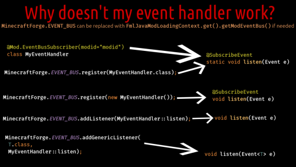

# 项目结构
项目结构是较为自由的，但在这个教程里我将让 mod 主类尽可能的小，并且在助手类中完成所有需要的设置。

此时的主类像是这样：
```java
@Mod(Tutorial.MOD_ID)
public class Tutorial {
    // 这里应该改成你自己的 mod id
    public static final String MOD_ID = "tutorial";
    private static final Logger LOGGER = LogManager.getLogger();

    public Tutorial() {
        // 注册 DeferredRegistry
        Registration.init();

        ModSetup.setup();

        // 为 mod 加载注册设置方法
        IEventBus modbus = FMLJavaModLoadingContext.get().getModEventBus();
        // 注册 'ModSetup::init'，它将在 mod setup 时被调用。 (服务端和客户端)
        modbus.addListener(ModSetup::init);
    }
}
```

然后我们创建一个名为 setup 的包，并且创建三个类文件，他们的内容分别是：
```java
// mcjty 的教程推荐 DistExecutor#unsafeRunWhenOn，两种皆可，见仁见智了。
@Mod.EventBusSubscriber(value = Dist.CLIENT, bus = Mod.EventBusSubscriber.Bus.MOD)
public class ClientSetup {
    @SubscribeEvent
    public static void init(final FMLClientSetupEvent event) {
        
    }
}
```
```java
public class ModSetup {  
    public static void init(final FMLCommonSetupEvent event) {  
    }
}
```
```java
public class Registration {  
    public static void init() {  
    }
}
```

下面张图说明了 EventBus#addListener、EventBusSubscriber 与监听器的关系：



补充一点：在 Event 实现了 IModBusEvent 的情况下，就需要使用 FMLJavaModLoadingContext.get().getModEventBus()（@Mod.EventBusSubscriber(bus = Mod.EventBusSubscriber.Bus.MOD)）来注册。

这里的 listen 补全的类大致是：
```java
public class MyEventHandler {
    ... void listen(Event e) {
        ...
    }
}
```

具体一些的例子可以在[延时执行](小工具/延时执行.md)中找到。

此时的项目应该看起来像这样：

