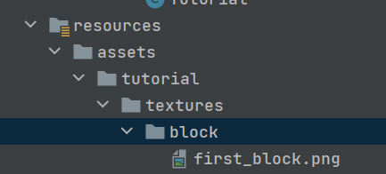
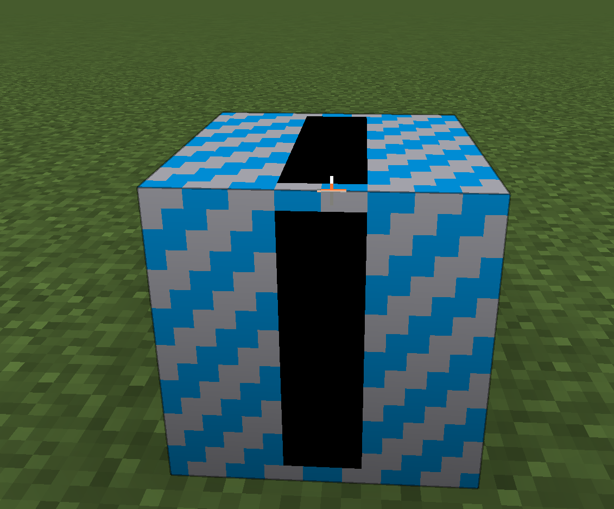
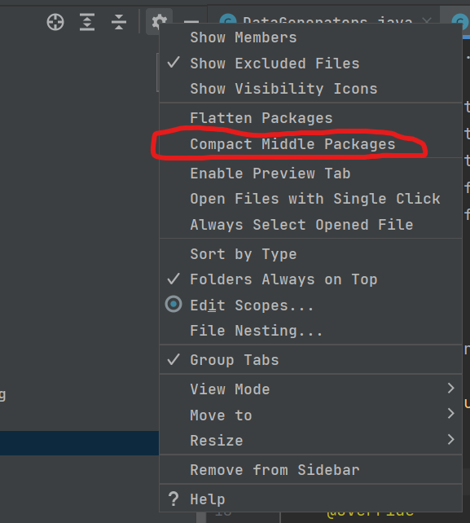

# Data Generation

[友链：一个专门的 DataGen 教程](https://skyinr.github.io/DatagenBook/#/zh-cn/)

如果你在上一节运行了 mod，会发现物品和方块的纹理都是经典紫黑块并且没有一个好名字。为了解决这个问题，我们需要制作模型和一堆其他 json。

我们将使用 Data Generation 来生成这些 json，因为这是最灵活的方式，也可以避免一些手写 json 带来的错误。

这不是必需的，如果你认为一个小 mod 不需要这种方式生成 json，手写也无所谓。

首先先创建一个名为“datagen”的包，并且创建一个如下的类：
```java
@Mod.EventBusSubscriber(modid = TutorialV3.MODID, bus = Mod.EventBusSubscriber.Bus.MOD)
public class DataGenerators {

    @SubscribeEvent
    public static void gatherData(GatherDataEvent event) {
        DataGenerator generator = event.getGenerator();
        if (event.includeServer()) {
            generator.addProvider(new TutRecipes(generator));
            generator.addProvider(new TutLootTables(generator));
            TutBlockTags blockTags = new TutBlockTags(generator, event.getExistingFileHelper());
            generator.addProvider(blockTags);
            generator.addProvider(new TutItemTags(generator, blockTags, event.getExistingFileHelper()));
        }
        if (event.includeClient()) {
            generator.addProvider(new TutBlockStates(generator, event.getExistingFileHelper()));
            generator.addProvider(new TutItemModels(generator, event.getExistingFileHelper()));
            generator.addProvider(new TutLanguageProvider(generator, "en_us"));
        }
    }
}
```
这个类使用了 @Mod.EventBusSubscriber 注解来确保他注册在正确的总线上以接收 GatherDataEvent 事件。这个事件会在使用“runData”的时候被触发。“runData”是一个特殊的模式，他没有普通的 Minecraft 窗口，但是对象会照常注册，然后触发 GatherDataEvent，让此事件能够生成 json。

json 会被生成到“generated”文件夹，不要手动更改里面的内容，因为每次运行 runData 都会覆盖里面的内容。

注意！在使用了 @Mod.EventBusSubscriber 的类里，所有方法都必须有 public 和 static 修饰符。

我们在这个包中需要各种各样的类，创建以下内容：

1. 合成表：
```java
public class TutRecipes extends RecipeProvider {

    public TutRecipes(DataGenerator generatorIn) {
        super(generatorIn);
    }

    @Override
    protected void buildCraftingRecipes(Consumer<FinishedRecipe> consumer) {
    }
}
```
2. 战利品表:
``` java
public class TutLootTables extends BaseLootTableProvider {

    public TutLootTables(DataGenerator dataGeneratorIn) {
        super(dataGeneratorIn);
    }

    @Override
    protected void addTables() {
    }
}
```
3. Block Tag:
   
Tag 的作用类似于矿物辞典，但又不完全相同。

由于新版本的变化，挖掘的工具由 tag 进行控制，此处的 MINEABLE_WITH_PICKAXE 的意思就是这个方块可以由镐子挖，NEEDS_IRON_TOOL 的意思则是挖掘等级至少在铁以上。
```java
public class TutBlockTags extends BlockTagsProvider {

    public TutBlockTags(DataGenerator generator, ExistingFileHelper helper) {
        super(generator, Tutorial.MOD_ID, helper);
    }

    @Override
    protected void addTags() {
        tag(BlockTags.MINEABLE_WITH_PICKAXE)
                .add(Registration.FIRST_BLOCK.get());
        tag(BlockTags.NEEDS_IRON_TOOL)
                .add(Registration.FIRST_BLOCK.get());
    }

    @Override
    public String getName() {
        return "Tutorial Tags";
    }
}
```
4. Item Tag:
```java
public class TutItemTags extends ItemTagsProvider {

    public TutItemTags(DataGenerator generator, BlockTagsProvider blockTags, ExistingFileHelper helper) {
        super(generator, blockTags, Tutorial.MOD_ID, helper);
    }

    @Override
    protected void addTags() {

    }

    @Override
    public String getName() {
        return "Tutorial Tags";
    }
}
```
5. Language:

作用是提供语言文件（json）的键值对，由于 Minecraft 默认语言是 en_us，所以需要生成一份英文的语言文件。
```java
public class TutLanguageProvider extends LanguageProvider {

    public TutLanguageProvider(DataGenerator gen, String locale) {
        super(gen, Tutorial.MOD_ID, locale);
    }

    @Override
    protected void addTranslations() {
        add("itemGroup." + ModSetup.GROUP_NAME, "Tutorial");
        add(Registration.FIRST_BLOCK.get(), "First Block");
    }
}
```
6. LanguageZh:
```java
public class TutLanguageZhProvider extends LanguageProvider {

    public TutLanguageZhProvider(DataGenerator gen, String locale) {
        super(gen, Tutorial.MOD_ID, locale);
    }

    @Override
    protected void addTranslations() {
        add("itemGroup." + ModSetup.GROUP_NAME, "教程");
        add(Registration.FIRST_BLOCK.get(), "第一个方块");
    }
}
```
7. 方块状态:
```java
public class TutBlockStates extends BlockStateProvider {

    public TutBlockStates(DataGenerator gen, ExistingFileHelper helper) {
        super(gen, Tutorial.MOD_ID, helper);
    }

    @Override
    protected void registerStatesAndModels() {
        simpleBlock(Registration.FIRST_BLOCK.get());
    }
}
```
7. 物品模型:
```java
public class TutItemModels extends ItemModelProvider {

    public TutItemModels(DataGenerator generator, ExistingFileHelper existingFileHelper) {
        super(generator, Tutorial.MOD_ID, existingFileHelper);
    }

    @Override
    protected void registerModels() {
        withExistingParent(Registration.FIRST_BLOCK.get().getRegistryName().getPath(), modLoc("block/first_block"));
    }
}
```

此时尝试运行会报错，怎么回事呢？

原来是生成的时候需要有贴图才会生成，以我的报错为例：
```
Caused by: java.lang.IllegalArgumentException: Texture tutorial:block/first_block does not exist in any known resource pack
	......
```
解决方法也很简单，按照他的指示，在 resources/assets/tutorial/textures/block 放上一张 first_block.png 即可。



再运行一次试试吧。



---

题外话：IDEA 老师，你这个文件夹怎么都展开了，这是可以说的吗？



让截图圈起来的部分处于未勾选状态就可以了。